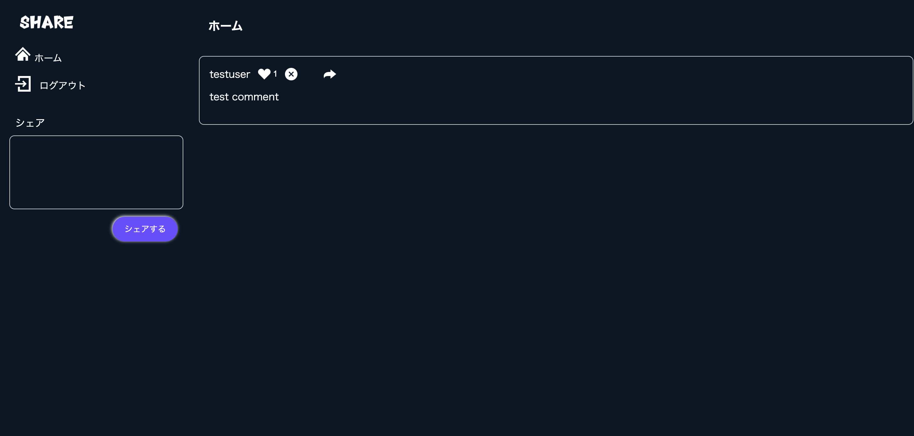

# Twitter風SNSアプリ

## 概要説明
Nuxt3（フロントエンド）とLaravel12（バックエンド）を使用して開発した、Twitter風のSNSアプリです。

ユーザーは投稿の作成・削除・いいね・コメントが可能で、
認証機能にはトークン認証（JWT）を使用しています。
フロントエンドとバックエンドをAPIで分離したSPA構成となっています。

## 作成した目的
フロントエンドとバックエンドを分離したSPA開発を学ぶために作成しました。
NuxtとLaravelを連携させ、認証やCRUD処理の流れを理解することを目的としています。

また、実務を想定してDocker環境で開発を行いました。

## 機能一覧

### 認証機能
- 新規登録
- ログイン
- ログアウト

### 投稿機能
- 投稿作成
- 投稿削除
- 投稿一覧表示

### SNS機能
- いいね機能
- コメント機能

## 使用技術（実行環境）

### フロントエンド
- Nuxt.js 3.32.0
- vue 3.5.27

### バックエンド
- Laravel　Framework 12.50.0
- PHP 8.2.30

### インフラ・開発環境
- Docker
- MySQL 5.7
- nginx 1.21.1

## ER図

## Dockerビルド
1. git clone git@github.com:reina017719/SNS-application.git
2. docker compose up -d --build

*MySQLは、OSによって起動しない場合があるのでそれぞれのPCに合わせて docker-compose.yml ファイルを編集してください。

## 環境構築

### バックエンド
1. docker compose exec php bash
2. composer install
3. cp .env.example .env
4. php artisan key:generate
5. php artisan migrate
6. php artisan db:seed

### フロントエンド
1. npm install
2. npm run dev

## ログイン情報 (テスト用)

- メールアドレス: `test@example.com`
- パスワード: `password123`

## URL
- Nuxt.js: `http://localhost/`
- Laravel: `http://localhost:3000/`
